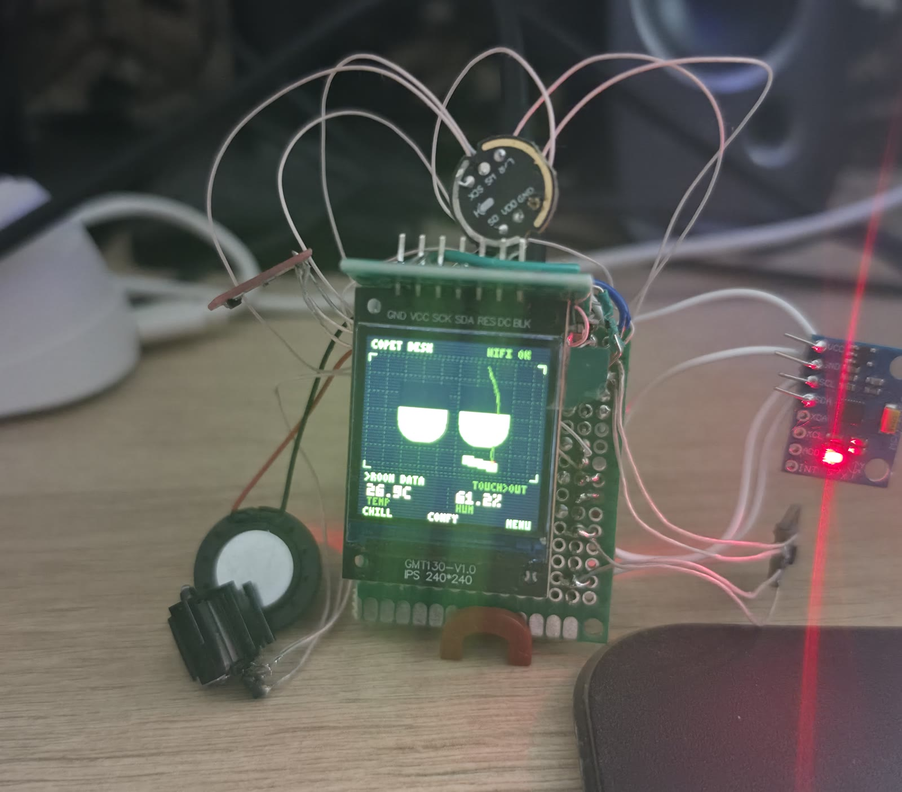
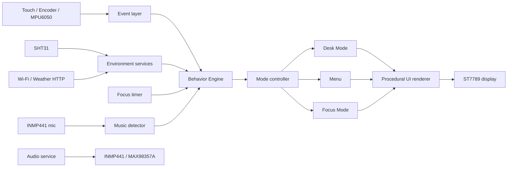
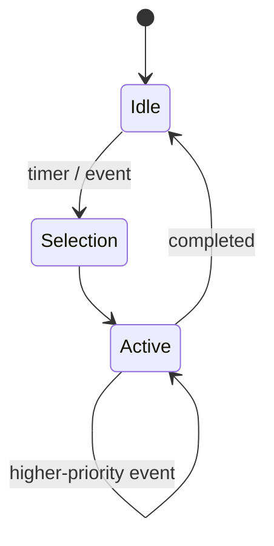

# CoPet Pilot

**An ESP32 desktop companion with a procedural animated face, environmental
sensing, a focus timer, local behaviors, audio, and direct Wi‑Fi features — no
phone app or cloud required.**

<p align="center">
  
</p>


`ESP32` · `ESP‑IDF` · `C` · `SPI` · `I²C` · `I²S` · `Wi‑Fi` · `BLE` · `Embedded UI`

---

## Overview

CoPet Pilot is a standalone desktop embedded companion built around an
ESP32‑WROOM‑32 DevKit and a 240 × 240 ST7789 display.

It combines a procedural animated character, room‑comfort sensing, focus
sessions, local interaction, audio hardware, and direct Wi‑Fi weather access —
all working on‑device, without a mandatory mobile application or cloud service.

The prototype boots straight into **Desk Mode**, where the character:

- blinks and moves its gaze procedurally;
- reacts to touch, petting, motion and impacts;
- shows indoor temperature and humidity;
- switches between indoor and outdoor (Wi‑Fi) weather on a touch;
- runs configurable focus sessions and keeps the timer when you leave;
- reacts to nearby music through the microphone.

---

## Demo

<!-- Add the GIFs/photos listed in docs/media/README.md; paths are ready. -->

| Desk Mode | Focus Mode | Hardware prototype |
|---|---|---|
|  |  |  |

Screen flow and wireframes: [screen storyboard](docs/ux/screen_storyboard.svg) ·
[user flow](docs/ux/user_flow.svg).

---

## My contribution

I designed and integrated the current prototype across hardware, firmware and
product interaction:

- selected and wired the ESP32, ST7789 display, SHT31, MPU6050, encoder,
  capacitive touch and I²S audio (INMP441 + MAX98357A);
- built the modular ESP‑IDF firmware architecture, separating mode logic,
  screen rendering, drivers and services from a thin `app_main` integration
  layer;
- implemented the Desk, Menu and Focus user flows;
- designed and implemented the priority‑based **Behavior Engine**;
- created the procedural facial animation system (emotions, gestures, reactions
  and idle activities) and environmental reactions;
- added direct Wi‑Fi weather retrieval and multi‑network scanning/selection;
- added a microphone loudness path and a music‑reactive "listening" behavior;
- wrote hardware‑independent host tests for behavior and state transitions;
- assembled and validated the physical prototype on real hardware.

---

## System architecture



Hardware access is isolated in `drivers/` and `services/`. Mode transitions and
behavior selection are pure, host‑testable logic with no direct dependency on
the ESP32 hardware, so they can be verified without flashing the board.

---

## Key capabilities

### Procedural desktop character

The face is drawn procedurally every frame rather than replayed from stored
frames. It supports blinking, gaze, touch/petting reactions and a large set of
emotion, gesture and idle‑activity styles.

### Priority‑based Behavior Engine

Events are resolved through priorities **P0–P3**. Critical and user‑driven
behaviors interrupt background ones; low‑priority idle activities are scheduled
without immediate repetition.

### Focus Mode

The encoder selects one of four presets — **25/5, 50/10, 60/20, 90/20**. Touch
starts, pauses and resumes the timer, and the remaining time is preserved when
returning to Desk Mode.

### Indoor and outdoor environment data

SHT31 provides local temperature and humidity. A short touch switches the
cards between indoor readings and outdoor weather fetched directly over Wi‑Fi.

### Multi‑network Wi‑Fi

Up to three networks can be configured. With two or more, the device scans the
air on boot and on reconnect and joins the highest‑priority known network in
range — so it works in several locations without reflashing.

Also included:

- encoder + capacitive‑touch interaction, with hold‑to‑pet;
- MPU6050 motion input (carry → dizzy, impact → angry, fall → scared);
- music‑reactive "listening" behavior from the microphone;
- I²S audio with embedded sound events;
- optional BLE diagnostics;
- fully local operation with no mandatory mobile app.

---

## Hardware

| Subsystem | Component | Interface | Purpose |
|---|---|---|---|
| Controller | ESP32‑WROOM‑32 DevKit | — | Processing and connectivity |
| Display | ST7789, 240 × 240 | SPI | Face and user interface |
| Input | Mouse‑wheel encoder | GPIO | Menu navigation, timer presets |
| Touch | TTP223 | GPIO | Contextual interaction, petting |
| Environment | SHT31 | I²C | Temperature and humidity |
| Motion | MPU6050 | I²C | Motion and orientation events |
| Microphone | INMP441 | I²S | Digital audio input |
| Amplifier | MAX98357A | I²S | Speaker output |
| Connectivity | ESP32 Wi‑Fi / BLE | RF | Weather and diagnostics |

SD storage and Mini TV are planned after the base architecture stabilizes.
GPS/GNSS and an outdoor mode are deferred to a later hardware revision. See the
[hardware map](docs/02_hardware_map.md) and [BOM](docs/06_bom_and_interfaces.md).

---

## Firmware architecture

```text
main/
├── app_main.c     Hardware bring-up and the main event loop
├── core/          Shared state IDs, the Behavior Engine, the music detector
├── modes/         Host-testable Desk, Menu, Focus, Settings, Animation logic
├── ui/            Shared drawing primitives and per-screen renderers
├── drivers/       Display, input, sensors, audio and connectivity drivers
└── services/      Wi-Fi, weather and network helpers

test/
└── host/          Hardware-independent state and behavior tests
```

`app_main.c` is deliberately a thin integration layer. User‑flow logic and
rendering live in `modes/` and `ui/`, which keeps state transitions testable on
a host machine and the hardware concerns contained in `drivers/`/`services/`.

---

## Behavior Engine

The Behavior Engine turns hardware, timer and network events into the visible
character behavior shown on screen.

| Priority | Typical source | Behavior |
|---|---|---|
| P0 | Critical / safety state | Immediate interruption |
| P1 | Direct user interaction | High‑priority reaction |
| P2 | Contextual device state | Temporary contextual behavior |
| P3 | Background activity | Scheduled idle animation |



The current firmware includes a first group of 12 procedural behaviors and a
second group of 4 (`happy`, `kawaii`, `chill`, `nervous`), plus gestures,
reactions and idle activities, all rendered procedurally. The scheduler avoids
repeating a background activity back‑to‑back. Design details:
[behavior engine v1](docs/24_behavior_engine_v1_spec.md),
[v2 group](docs/26_behavior_engine_v2_group.md),
[behavior catalogue](docs/20_animation_behavior_decisions.md).

---

## Verification and testing

### Hardware validation

Exercised on the working prototype: ST7789 rendering, SHT31 measurements,
encoder and TTP223 input, MPU6050 events, Focus Mode, BLE diagnostics, I²S
microphone‑to‑amplifier audio, procedural animation, and direct Wi‑Fi weather
retrieval.

### Host tests

Hardware‑independent logic is tested on the development machine (no board):

| Suite | Coverage |
|---|---|
| `copet_behavior` | P0–P3 resolution, interruption, cooldown, no‑repeat, petting, motion |
| `focus_mode` | Presets, start/pause/resume, work↔break, remaining‑time persistence |
| `music_detector` | Sustained‑fluctuation detection (ignores steady noise) |
| `desk_mode` | Motion classification (carry / tilt / impact / fall) |
| `menu_mode` · `settings_mode` · `animation_mode` · `wifi_credentials` | Selection, toggles, timing, network matching |

**Current result: 210 checks passing across 8 suites (70 behavior checks).**

```bash
powershell -File test/host/run_tests.ps1
```

---

## Current status

**Working hardware prototype.** Implemented and validated: Desk Mode, Focus
Mode, procedural face rendering, environment sensing, direct Wi‑Fi weather,
behavior prioritization, audio with sound events, microphone listening, and a
modular mode/UI architecture with host‑side tests.

### Not yet implemented

- Assistant mode;
- Mini TV and SD‑based media playback;
- persistent configuration and provisioning UI;
- custom PCB and production enclosure;
- GPS/GNSS and outdoor mode.

---

## Build and flash

**Requirements:** ESP‑IDF 6.0.1, target `esp32`, an ESP32‑WROOM‑32 DevKit.

```bash
idf.py set-target esp32
idf.py build
idf.py -p COM3 flash monitor
```

The serial port name will differ between systems.

### Local Wi‑Fi configuration

```bash
idf.py menuconfig
```

Then, under **CoPet Pilot**, set the Wi‑Fi SSID/password (and optional 2nd/3rd
networks) and the weather latitude/longitude. Credentials are stored only in
the local `sdkconfig`, which is excluded from Git. With no credentials the
device still runs and shows `WIFI SET`. Details:
[Wi‑Fi bring‑up log](docs/21_wifi_station_learning_log.md).

---

## Repository structure

```text
.
├── main/                   ESP-IDF firmware (drivers, services, modes, ui, core)
├── test/host/              Hardware-independent tests + runner
├── docs/
│   ├── architecture/       Architecture decision records
│   ├── ux/                 User flows and screen wireframes
│   ├── media/              README images (add your own)
│   └── *.md                Design notes and hardware/bring-up logs
├── tools/                  Asset conversion scripts (sounds, animation)
├── THIRD_PARTY_LICENSES/   Third-party license texts
├── CMakeLists.txt
└── CoPet_Pilot_general_spec.md
```

---

## Documentation

| Document | Description |
|---|---|
| [General specification](CoPet_Pilot_general_spec.md) | Product scope and requirements |
| [System architecture](docs/01_architecture.md) | Firmware and hardware architecture |
| [Architecture decisions](docs/architecture/) | Recorded design decisions (ADRs) |
| [User flows](docs/ux/01_user_cases_and_screen_flow.md) | Screen flow and interactions |
| [Hardware map](docs/02_hardware_map.md) | Pin plan and integration notes |
| [Behavior engine](docs/24_behavior_engine_v1_spec.md) | Priorities and animation groups |
| [Wi‑Fi validation](docs/21_wifi_station_learning_log.md) | Direct Wi‑Fi bring‑up on the board |

---

## Roadmap

**Next:** finish the enclosure revision, complete display‑driver separation, add
SD storage, restore the gallery animation from SD assets, add persistent
configuration, and document power consumption.

**Later:** Assistant mode, Mini TV, a custom PCB, GPS/GNSS and an outdoor mode,
and a lower‑power hardware revision.

---

## Attribution

The procedural eye‑animation concept was inspired by
[`esp-bridge-mcp-robot`](https://github.com/HamzaYslmn/). Selected animation
mechanics were ported to C and adapted for the color ST7789 display and the
CoPet Pilot behavior system — this repository is a modified derivative
implementation, not the original Pip.

Original project by Hamza Yeşilmen — [source](https://github.com/HamzaYslmn/) ·
[sponsor](https://github.com/sponsors/HamzaYslmn). The applicable license text
is preserved in
[`THIRD_PARTY_LICENSES/esp-bridge-mcp-robot-LICENSE.txt`](THIRD_PARTY_LICENSES/esp-bridge-mcp-robot-LICENSE.txt).
