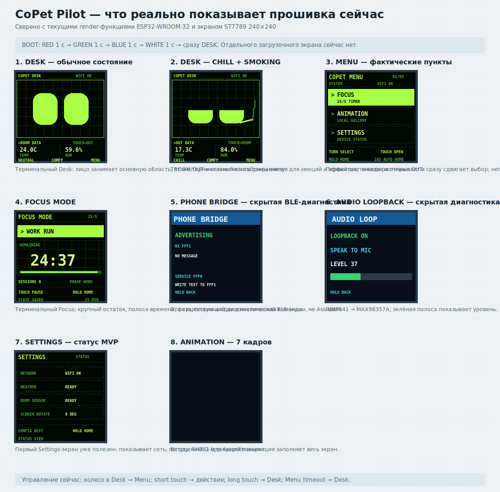
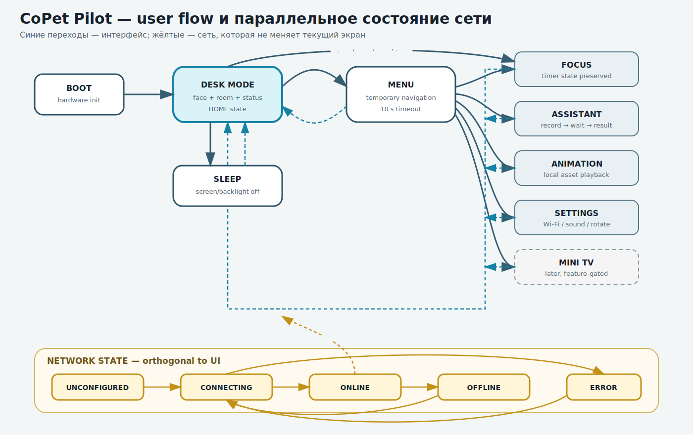
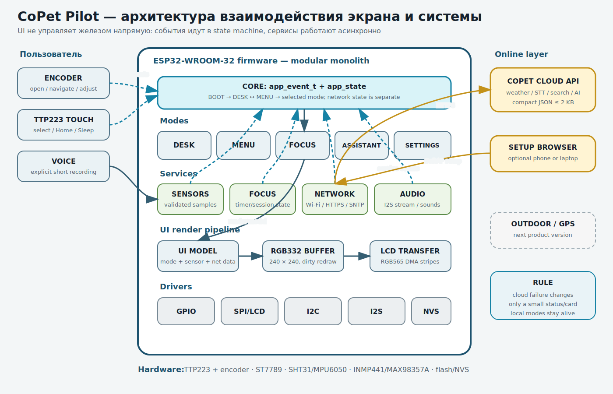

# CoPet Pilot — user cases and screen flow

This document describes the target UX before the firmware state-machine
refactor. It is a product specification, not a statement that every screen is
already implemented.

## Visual overview







## UX principles

1. CoPet is a character first and a menu second.
2. Power-on always ends in Desk Mode, never in a menu.
3. The encoder opens and navigates the menu.
4. A short touch confirms the current action.
5. A long touch is the universal Home action and returns to Desk Mode.
6. Network failure is shown as a status, not as a blocking screen.
7. The screen shows one primary action at a time.

## Physical controls

| Input | Desk Mode | Menu | Other modes |
|---|---|---|---|
| encoder left/right | open Menu and move selection | move selection | adjust a mode value when supported |
| short touch | context action | open selected item | start/pause/confirm |
| double touch | quick Focus Mode | no special action | no special action |
| long touch, 1 second | no-op/Home feedback | return to Desk | return to Desk |
| hold, 5 seconds | enter Sleep | enter Sleep | enter Sleep |

The current three-contact wheel has no press action. Selection is therefore
confirmed with TTP223.

## Common screen layout

```text
┌────────────────────────┐  y=0
│ status: time / Wi-Fi   │  28 px
├────────────────────────┤
│                        │
│ primary content        │  184 px
│                        │
├────────────────────────┤
│ one action hint        │  28 px
└────────────────────────┘  y=240
```

Desk Mode may hide the footer during idle animation. Network status uses a
small header indicator:

- `NET` — online;
- `...` — connecting;
- `OFF` — offline/unconfigured;
- `!` — recoverable network error.

## UC-01 — Power on and reach Desk Mode

**Actor:** user
**Trigger:** USB power or reset
**Precondition:** none

```text
BOOT screen for hardware initialization
→ display ready
→ input ready
→ local settings loaded
→ DESK_MODE
→ Wi-Fi connection continues in background
```

The Boot screen shows only `COPET`, initialization progress and a recoverable
module warning if needed. It must not wait for Wi-Fi.

**Done when:** the face appears even with the router turned off.

## UC-02 — Observe CoPet in Desk Mode

Desk Mode shows:

- CoPet face/idle animation as the main content;
- current time when available;
- temperature and humidity;
- a small network indicator;
- short reactions to touch, movement and comfort state.

The screen does not continuously show a large menu. After inactivity, any
temporary card disappears and the face returns.

## UC-03 — Open and navigate Menu

**Trigger:** rotate the encoder in Desk Mode.

The first detent both opens Menu and moves the highlight in the rotation
direction. Proposed visible items:

```text
FOCUS
ASSISTANT
ANIMATION
MINI TV       later/feature-gated
SETTINGS
```

Current MVP visibility follows the same order but hides unfinished features:

```text
FOCUS
ANIMATION
SETTINGS
```

`ASSISTANT` is added after its idle/error screen and bounded text request are
implemented. `MINI TV` remains hidden until SD hardware and playback are ready.
BLE and audio loopback remain developer diagnostics and are not product-menu
items.

- encoder changes highlight;
- short touch opens the highlighted item;
- long touch returns to Desk Mode;
- 10 seconds without input returns to Desk Mode;
- unavailable features are hidden instead of opening an empty screen.

## UC-04 — Run Focus Mode

States:

```text
WORK READY → WORK RUN → WORK PAUSE
WORK complete → BREAK READY → BREAK RUN
BREAK complete → WORK READY
```

Screen priority:

1. remaining time in the largest type;
2. `WORK` or `BREAK` state;
3. completed session count;
4. one control hint.

Short touch starts/pauses. Long touch returns Home without deleting the timer
state. Reopening Focus shows the same remaining time.

The current MVP pauses a running interval when Home is requested, preserves the
remaining time and restores it on the next Focus entry. The footer command is
state-dependent: `TOUCH START`, `TOUCH PAUSE` or `TOUCH RESUME`.

## UC-05 — Ask the Online Assistant

Assistant sub-flow:

```text
ASSISTANT_IDLE
  └─ short touch → RECORDING (maximum 5 seconds)
       ├─ short touch → stop early
       └─ timeout → UPLOADING → WAITING
                              ├─ success → RESULT
                              └─ error   → ERROR
```

Screens show:

- Idle: `TOUCH TO ASK`;
- Recording: `LISTENING`, countdown and microphone level;
- Waiting: calm animation and `THINKING`;
- Result: short text card, normally no more than 2–4 display lines;
- Error: human-readable offline/timeout message and `TOUCH RETRY`.

Long touch returns to Desk Mode from every Assistant state. Leaving the mode
cancels recording/upload safely.

## UC-06 — Configure Wi-Fi

Path:

```text
Desk → encoder → Menu → Settings → Wi-Fi Setup
```

The setup screen shows:

```text
CONNECT TO
COPET-SETUP
OPEN 192.168.4.1
```

ESP32 temporarily starts a SoftAP and local setup page. A phone or laptop
browser enters SSID/password. The device stores credentials in NVS, stops the
setup AP and reconnects in station mode.

Cancel or setup failure returns to Settings; local modes keep working.

## UC-07 — Change screen settings

Settings MVP items:

- Wi-Fi status/setup/forget network;
- sound on/off or volume level;
- screen rotation `0° / 180°`;
- brightness if backlight control hardware is added;
- device information and firmware version.

Each value is changed with the encoder and confirmed with short touch. Long
touch returns directly to Desk Mode.

## UC-08 — Sleep and wake

Holding touch for five seconds enters Sleep:

- stop animation refresh;
- turn off display/backlight;
- stop temporary network activity;
- preserve settings and Focus state.

Touch wakes the device into Desk Mode. MPU6050 wake is added only after the
sensor behavior is proven repeatable.

## Screen inventory

| Screen | Required for base MVP | Network required |
|---|---:|---:|
| Boot | yes | no |
| Desk | yes | no |
| Menu | yes | no |
| Focus | yes | no |
| Animation | yes | no |
| Assistant idle/error | yes | no |
| Assistant request/result | later online milestone | yes |
| Settings | yes | no |
| Wi-Fi Setup | Direct Wi-Fi milestone | SoftAP only |
| Mini TV | later milestone | no |
| Outdoor | next product version | no |

## Implementation order

1. Implement pure state transitions and Desk-first navigation.
2. Render Boot, Desk, Menu, Focus and Settings wireframes with fake data.
3. Connect existing SHT31, animation and Focus logic to the new screens.
4. Add network-status model without real Wi-Fi.
5. Add Wi-Fi provisioning/SNTP/HTTPS one service at a time.
6. Add Assistant text request before microphone upload.
